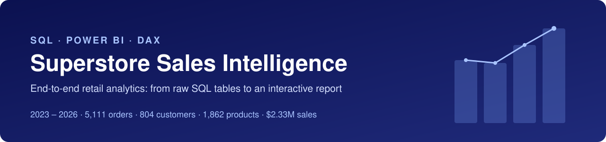
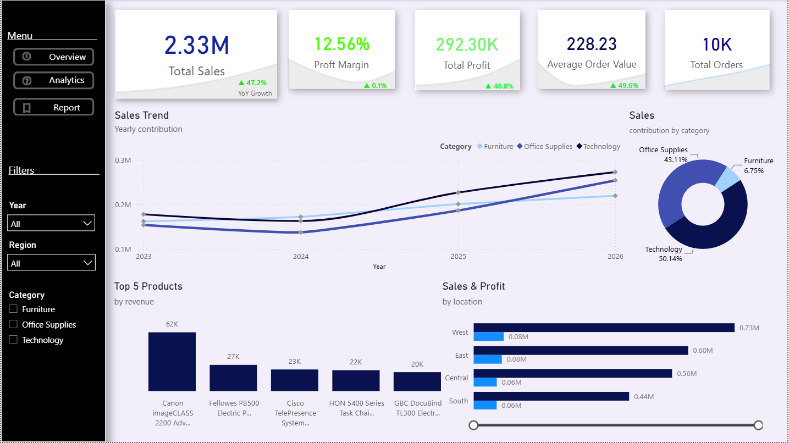
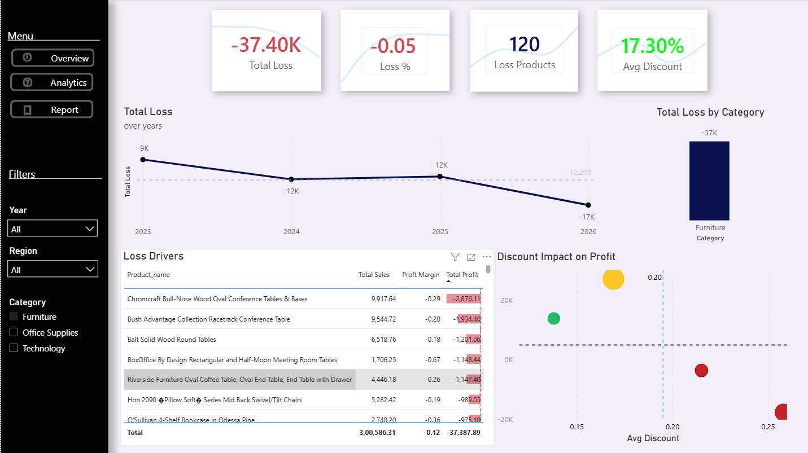
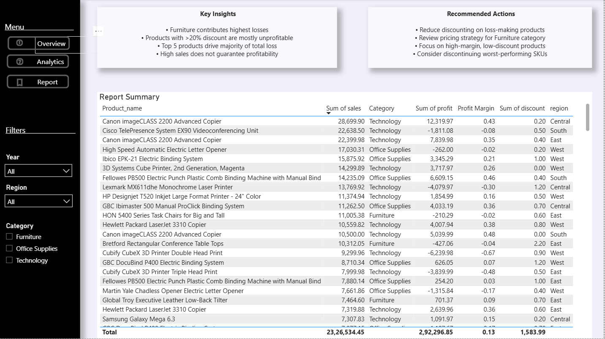
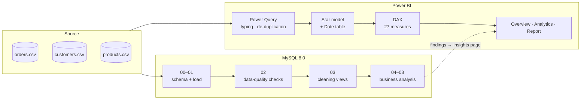
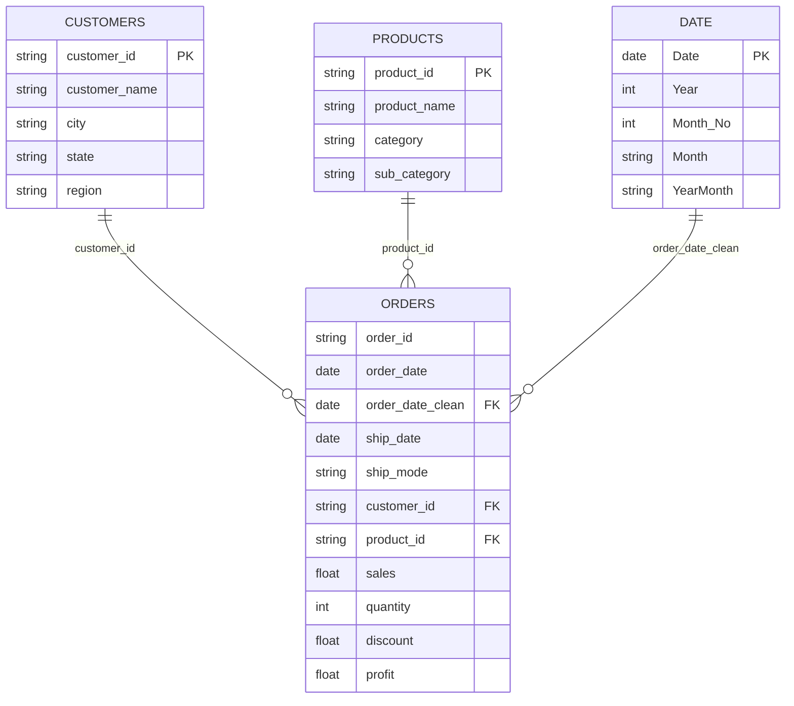

<p align="center">
  
</p>

<p align="center">
  
  
  
  
  
</p>

<p align="center">
  <a href="#-dashboard-preview">Preview</a> ·
  <a href="#-key-insights">Insights</a> ·
  <a href="#-solution-architecture">Architecture</a> ·
  <a href="#-sql-analysis">SQL</a> ·
  <a href="#-data-model">Data model</a> ·
  <a href="#-repository-structure">Structure</a> ·
  <a href="#-how-to-run">How to run</a>
</p>

---

## 📌 Overview

An end-to-end retail analytics project on the **Superstore** dataset. Raw order, customer and product extracts are loaded into **MySQL**, validated and cleaned with SQL, analysed with business-question queries, then modelled in **Power BI** as a 3-page interactive report.

| # | Business question | Answered in |
|---|---|---|
| 1 | How are sales, profit and margin trending? | SQL `04`, `07` · **Overview** page |
| 2 | Which regions, categories and products drive (or destroy) profit? | SQL `04`, `06` · **Overview**, **Analytics** |
| 3 | How much do discounts cost the business? | SQL `08` · **Analytics** page |
| 4 | Who are the most valuable customers, and do they come back? | SQL `05` |
| 5 | What should management do next? | **Report** page |

**Scope:** 10,194 order lines · 5,111 orders · 804 customers · 1,862 products · Jan 2023 – Dec 2026.

---

## 📸 Dashboard Preview

<table>
  <tr>
    <td colspan="2"><b>Overview</b> — KPIs with YoY, sales trend by category, top products, region performance<br>
    </td>
  </tr>
  <tr>
    <td width="50%"><b>Analytics</b> — loss drivers and discount impact <i>(Furniture selected)</i><br>
    </td>
    <td width="50%"><b>Report</b> — key insights, recommended actions, detail table<br>
    </td>
  </tr>
</table>

Page-by-page guide to every visual and measure → **[docs/report-pages.md](docs/report-pages.md)**

---

## 💡 Key Insights

> All figures are reproduced by the SQL scripts in [`sql/`](sql/) and reconcile to the Power BI totals.

| Theme | Finding |
|---|---|
| **Healthy growth** | Sales grew **51%** from $494K (2023) to $746K (2026). The only dip was 2024 (−4.3%). Margin improved from 10.5% to 12.9%. |
| **Discounts destroy profit** | Lines discounted **above 20%** are 15.7% of sales but lose **$136K**. Margin is 29.6% with no discount, −15.3% at 21–40%, and −77.4% above 40%. |
| **Furniture problem** | Furniture is **32% of sales but earns a 2.6% margin**. Tables (−8.5%) and Bookcases (−3.2%) lose money outright. |
| **Technology carries profit** | Technology earns **50% of all profit** ($146.5K, 17.4% margin). Copiers alone run at a 37% margin. |
| **Region trade-off** | West is the largest region (31.5% of sales) but has the **lowest margin** (11.5%). South is the smallest but most profitable (14.8%). |
| **Q4 seasonality** | **Q4 brings 38%** of annual sales, against 16% in Q1. |
| **Loyal base** | **98.5%** of customers order more than once. 119 high-value customers (15%) generate 40% of sales. |
| **Loss tail** | **299 products** lose money on a net basis, totalling −$77.3K. |

---

## 🧱 Solution Architecture



---

## 🧮 SQL Analysis

| Script | Purpose | Key techniques |
|---|---|---|
| [`00_create_schema.sql`](sql/00_create_schema.sql) | Raw landing tables with indexes | DDL, `utf8mb4` |
| [`01_load_data.sql`](sql/01_load_data.sql) | Load the three CSV extracts and validate row counts | `LOAD DATA LOCAL INFILE` |
| [`02_data_quality_checks.sql`](sql/02_data_quality_checks.sql) | Duplicates, orphan keys, nulls, unparseable dates, ranges | `LEFT JOIN` anti-patterns, `HAVING` |
| [`03_data_cleaning.sql`](sql/03_data_cleaning.sql) | Non-destructive cleaning views (`v_orders`, `v_customers`, `v_products`) | `STR_TO_DATE`, `DATEDIFF`, views |
| [`04_sales_analysis.sql`](sql/04_sales_analysis.sql) | KPIs, region and category performance | window `SUM() OVER ()` shares |
| [`05_customer_analysis.sql`](sql/05_customer_analysis.sql) | Top customers, CLV, AOV, value segments, repeat rate, ranking | CTEs, `DENSE_RANK`, `PERCENT_RANK` |
| [`06_product_analysis.sql`](sql/06_product_analysis.sql) | Best sellers, margins, loss-making products | `HAVING`, CTE aggregation |
| [`07_time_analysis.sql`](sql/07_time_analysis.sql) | YoY growth, monthly trend, seasonality | `LAG`, moving average frame |
| [`08_shipping_and_discount_analysis.sql`](sql/08_shipping_and_discount_analysis.sql) | Delivery time by ship mode, discount bands vs profit | `CASE` banding |

Query-by-query results and what changed from the first version → **[docs/sql-analysis.md](docs/sql-analysis.md)**

---

## 🧩 Data Model



Tables, columns and all 27 DAX measures → [docs/data-model.md](docs/data-model.md) · [docs/dax-measures.md](docs/dax-measures.md)

---

## 📁 Repository Structure

```text
superstore-sales-analysis-sql-powerbi/
├── README.md
├── dashboard/
│   └── Superstore-Intelligence.pbix      ← Power BI report + model
├── sql/
│   ├── 00_create_schema.sql
│   ├── 01_load_data.sql
│   ├── 02_data_quality_checks.sql
│   ├── 03_data_cleaning.sql
│   ├── 04_sales_analysis.sql
│   ├── 05_customer_analysis.sql
│   ├── 06_product_analysis.sql
│   ├── 07_time_analysis.sql
│   └── 08_shipping_and_discount_analysis.sql
├── docs/
│   ├── sql-analysis.md                   ← results of every query + changelog
│   ├── data-model.md                     ← tables, relationships, Power Query
│   ├── dax-measures.md                   ← all 27 measures
│   ├── report-pages.md                   ← page-by-page visual guide
│   └── model-review.md                   ← data-quality findings + v2 roadmap
└── assets/
    ├── banner.svg
    └── screenshots/
        ├── 01-overview.png
        ├── 02-analytics.png
        └── 03-report.png
```

---

## 🚀 How to Run

**SQL (MySQL 8.0)**

1. Run [`00_create_schema.sql`](sql/00_create_schema.sql).
2. Load the CSVs with [`01_load_data.sql`](sql/01_load_data.sql) (replace `<path>`), or use MySQL Workbench's *Table Data Import Wizard*.
3. Run `02` → `03` once, then any analysis script `04`–`08` in any order.

**Power BI**

1. Open [`dashboard/Superstore-Intelligence.pbix`](dashboard/Superstore-Intelligence.pbix) in Power BI Desktop. The data is already imported.
2. Use the left-hand menu to move between pages and the **Year / Region / Category** filters to slice.
3. *(Optional, to refresh)* **Transform data → Data source settings → Change source** for the three CSV files.

---

## 🛠️ Skills Demonstrated

| Area | Applied in this project |
|---|---|
| **SQL** | DDL, bulk load, data-quality checks, views, joins, CTEs, window functions (`LAG`, `DENSE_RANK`, `PERCENT_RANK`, running frames), `CASE` banding |
| **Data cleaning** | Text-to-date conversion, de-duplication, key validation, ID-vs-name grouping |
| **Power BI** | Star schema, Power Query typing and de-duplication, calendar table, page navigation, slicers, conditional formatting |
| **DAX** | `CALCULATE`, `SAMEPERIODLASTYEAR`, `RANKX`, `SUMX`/`FILTER` loss logic, dynamic text and colour measures |
| **Business analysis** | Profitability, discount elasticity, customer value segmentation, recommendations |

---

## 🗺️ Roadmap (v2)

- [ ] Count orders with `DISTINCTCOUNT` (the report currently counts order lines)
- [ ] Pin YoY cards to the latest selected year
- [ ] Repair the `segment` / `country` columns in the customer extract
- [ ] Fix product-name encoding (Windows-1252 source read as UTF-8)
- [ ] Turn off auto date/time and drive every visual from the `Date` table

Details and the exact fixes → [docs/model-review.md](docs/model-review.md)

---

## 👤 Author

**Tanmay Mandal** — Business Analyst · Operations & ERP analytics
GitHub: [@tanmaymandal0207-cmyk](https://github.com/tanmaymandal0207-cmyk)

## © License

Copyright © 2026 Tanmay Mandal. **All rights reserved.** No license is granted to copy, modify or redistribute this work. You may view it here for portfolio purposes.
The Superstore dataset is a public sample dataset and remains the property of its original publisher.
