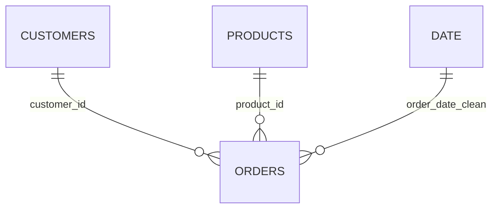
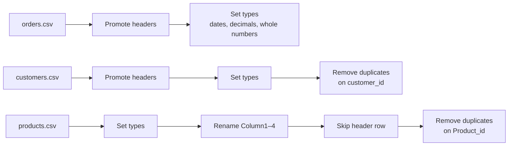

# Data Model

[← Back to README](../README.md)

Star schema: one fact table (`orders`, grain = order line) with three dimensions.



| Table | Type | Rows | Grain | Source |
|---|---|---:|---|---|
| orders | Fact | 10,194 | 1 row per order line | `orders.csv` |
| customers | Dimension | 804 | 1 row per customer | `customers.csv` (de-duplicated on `customer_id`) |
| products | Dimension | 1,862 | 1 row per product | `products.csv` (de-duplicated on `Product_id`) |
| Date | Dimension (DAX) | 1,458 | 1 row per day, 2023-01-03 → 2026-12-30 | `CALENDAR` over order dates |

Relationships (all many-to-one, single-direction): `orders[customer_id]` → `customers[customer_id]`, `orders[product_id]` → `products[Product_id]`, `orders[order_date_clean]` → `Date[Date]`. Auto date/time is also on, which adds 4 hidden local date tables.

---

## Data dictionary

### orders

| Column | Type | Description |
|---|---|---|
| order_id | Text | Order number. One order spans one or more lines |
| order_date | Date | Order date |
| ship_date | Date | Ship date |
| ship_mode | Text | Same Day · First Class · Second Class · Standard Class |
| customer_id | Text | FK → customers |
| product_id | Text | FK → products |
| sales | Decimal | Line revenue |
| quantity | Whole | Units |
| discount | Decimal | Discount rate, 0 – 0.80 |
| profit | Decimal | Line profit (can be negative) |
| order_date_clean / ship_date_clean | Date | Typed copies created in v1 SQL; identical to the date columns |

### customers

| Column | Type | Description |
|---|---|---|
| customer_id | Text | PK |
| customer_name | Text | Not unique: one name maps to 5 IDs |
| segment<country | Whole | ⚠ Broken header in the extract; see [model-review](model-review.md#1-data-quality-findings) |
| city / state / region | Text | Location; region = Central · East · South · West |

### products

| Column | Type | Description |
|---|---|---|
| Product_id | Text | PK |
| Product_name | Text | Not unique: 17 names map to several IDs |
| Category | Text | Furniture · Office Supplies · Technology |
| Sub Category | Text | 17 sub-categories |
| Short Name | Text | DAX column: name truncated to 25 characters for axis labels |

### Date (calculated table)

```DAX
Date =
ADDCOLUMNS (
    CALENDAR ( MIN ( orders[order_date] ), MAX ( orders[order_date] ) ),
    "Year",      YEAR ( [Date] ),
    "Month No",  MONTH ( [Date] ),
    "Month",     FORMAT ( [Date], "MMM" ),
    "YearMonth", FORMAT ( [Date], "YYYY-MM" )
)
```

---

## Power Query



<details>
<summary>M code (click to expand)</summary>

```powerquery
// orders
let
    Source = Csv.Document(File.Contents("<path>\orders.csv"),
        [Delimiter = ",", Columns = 12, Encoding = 1252, QuoteStyle = QuoteStyle.None]),
    #"Promoted Headers" = Table.PromoteHeaders(Source, [PromoteAllScalars = true]),
    #"Changed Type" = Table.TransformColumnTypes(#"Promoted Headers", {
        {"order_id", type text}, {"order_date", type date}, {"ship_date", type date},
        {"ship_mode", type text}, {"customer_id", type text}, {"product_id", type text},
        {"sales", type number}, {"quantity", Int64.Type}, {"discount", type number},
        {"profit", type number}, {"order_date_clean", type date}, {"ship_date_clean", type date}})
in
    #"Changed Type"

// customers
let
    Source = Csv.Document(File.Contents("<path>\customers.csv"),
        [Delimiter = ",", Columns = 6, Encoding = 65001, QuoteStyle = QuoteStyle.Csv]),
    #"Promoted Headers" = Table.PromoteHeaders(Source, [PromoteAllScalars = true]),
    #"Changed Type" = Table.TransformColumnTypes(#"Promoted Headers", {
        {"customer_id", type text}, {"customer_name", type text},
        {"segment<#(cr)#(lf)country", Int64.Type},
        {"city", type text}, {"state", type text}, {"region", type text}}),
    #"Removed Duplicates" = Table.Distinct(#"Changed Type", {"customer_id"})
in
    #"Removed Duplicates"

// products
let
    Source = Csv.Document(File.Contents("<path>\products.csv"),
        [Delimiter = ",", Columns = 4, Encoding = 65001, QuoteStyle = QuoteStyle.None]),
    #"Changed Type" = Table.TransformColumnTypes(Source, {
        {"Column1", type text}, {"Column2", type text}, {"Column3", type text}, {"Column4", type text}}),
    #"Renamed Columns" = Table.RenameColumns(#"Changed Type", {
        {"Column1", "Product_id"}, {"Column2", "Product_name"},
        {"Column3", "Category"},   {"Column4", "Sub Category"}}),
    #"Removed Top Rows" = Table.Skip(#"Renamed Columns", 1),
    #"Removed Duplicates" = Table.Distinct(#"Removed Top Rows", {"Product_id"})
in
    #"Removed Duplicates"
```

</details>

`<path>` replaces the original local folder. Update it via **Transform data → Data source settings**.
