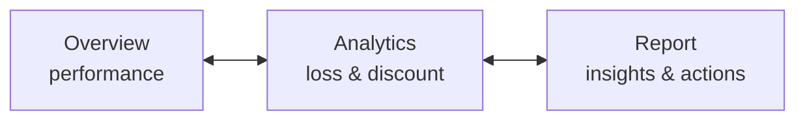

# Report Pages

[← Back to README](../README.md)

Every page shares a **left navigation panel** (Overview · Analytics · Report buttons) and the same **Year / Region / Category** filters. Canvas: 1280 × 720.

| Page | Question it answers | Visual containers |
|---|---|---:|
| [Overview](#1-overview) | How is the business performing? | 38 |
| [Analytics](#2-analytics) | Where is profit being lost, and why? | 31 |
| [Report](#3-report) | What should management do? | 18 |

---

## 1. Overview

| Visual | Type | Fields / measures |
|---|---|---|
| KPI cards ×5 | Card + sparkline | `Total Sales`, `Proft Margin`, `Total Profit`, `Average Order Value`, `Total Orders` |
| YoY badges | Card | `YoY Growth`, `Margin Display`, `Profit YoY Display`, `Orders YoY Display` |
| Sales Trend | Line, by category | `order_date` (Year) · `sales` · `Category` |
| Contribution by category | Donut | `Category` · `Total Profit` |
| Top 5 Products | Column | `Short Name` · `Total Sales` |
| Sales & Profit by location | Clustered bar | `region` · `Total Sales`, `Total Profit` |

**How to read it:** all three categories grow after 2024. Technology leads sales, and the donut shows Furniture earns only 6.75% of profit.

---

## 2. Analytics

*Screenshot shows the Category filter set to Furniture.*

| Visual | Type | Fields / measures |
|---|---|---|
| KPI cards ×4 | Card + sparkline | `Total Loss`, `Loss %`, `Loss Products`, `Avg Discount` |
| Total Loss over years | Line + average line | `order_date` (Year) · `Total Loss` |
| Total Loss by Category | Column | `Category` · `Total Loss` |
| Loss Drivers | Table with data bars | `Product_name` · `Total Sales` · `Proft Margin` · `Total Profit` |
| Discount Impact on Profit | Scatter, quadrant-coloured | X `Avg Discount` · Y `Total Profit` · size `Total Sales` · per `Sub Category` · colour `Quadrant Color` |

**How to read it:** with Furniture selected, 120 products lose $37.4K, and the yearly loss rises from −$9K (2023) to −$17K (2026). In the scatter, sub-categories to the right of the ~20% discount line fall below zero profit.

---

## 3. Report

| Visual | Type | Content |
|---|---|---|
| Key Insights | Text | Furniture drives losses · >20% discount mostly unprofitable · high sales ≠ profit |
| Recommended Actions | Text | Cut discounts on loss-makers · review Furniture pricing · focus on high-margin, low-discount products · consider dropping worst SKUs |
| Report Summary | Table | `Product_name` · sales · `Category` · profit · `Profit Margin` · discount · `region` |
