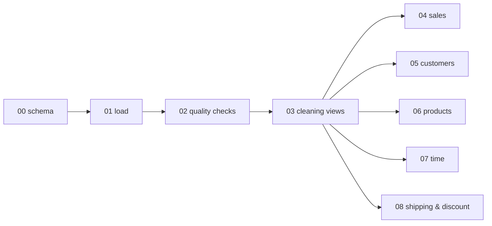

# SQL Analysis

[← Back to README](../README.md)

Engine: **MySQL 8.0**. Every script was also run end-to-end on MariaDB 10.11 against the project data, and the results below are from that run.

---

## 02 · Data-quality checks

| Check | Result |
|---|---|
| Order lines / distinct orders | 10,194 / 5,111 (avg 2 lines per order) |
| Duplicate keys in `customers` / `products` | 0 / 0 |
| Exact duplicate order lines | **2** (`CA-2023-153623`, `US-2023-150119`) |
| Orphan customer / product keys | 0 / 0 |
| Blank IDs, dates, sales, profit | 0 |
| Unparseable dates | 0 |
| Discount range | 0% – 80% |
| Customer names shared by several IDs | 1 name → 5 IDs |

## 03 · Cleaning views

| View | What it fixes |
|---|---|
| `v_orders` | Text dates (`dd-mm-yyyy`) → `DATE`; adds `delivery_days`, `order_year`, `order_month`; trims keys |
| `v_customers` | Guarantees one row per `customer_id` |
| `v_products` | Guarantees one row per `product_id` |

Validation: 10,194 raw lines = 10,194 view lines, 0 unparsed dates, 0 unmatched keys.

---

## 04 · Sales

| KPI | Value |
|---|---:|
| Total sales | $2,326,534.45 |
| Total profit | $292,296.85 |
| Profit margin | 12.56% |
| Orders | 5,111 |
| Units sold | 38,654 |
| Average order value | $455.20 |

| Region | Sales | Profit | Margin | Share |
|---|---:|---:|---:|---:|
| West | $732,099 | $84,170 | 11.50% | 31.5% |
| East | $601,658 | $78,979 | 13.13% | 25.9% |
| Central | $556,607 | $64,737 | 11.63% | 23.9% |
| South | $436,171 | $64,411 | 14.77% | 18.8% |

| Category | Sales | Profit | Margin |
|---|---:|---:|---:|
| Technology | $839,893 | $146,543 | 17.45% |
| Furniture | $754,748 | $19,730 | **2.61%** |
| Office Supplies | $731,893 | $126,023 | 17.22% |

Loss-making sub-categories: **Tables (−8.53%)**, **Bookcases (−3.15%)**, **Supplies (−2.51%)**. Best margins: Labels 43.9%, Paper 43.4%, Envelopes 42.3%, Copiers 37.2%.

## 05 · Customers

| Value segment | Customers | Sales share |
|---|---:|---:|
| High (> 5,000) | 119 | 40.1% |
| Mid (2,000 – 5,000) | 326 | 44.5% |
| Low (< 2,000) | 359 | 15.4% |

Repeat customers: **792 (98.5%)**; one-time: 12. Top customer: SM-20320, $25,043 lifetime sales but **−$1,981 profit**, so the highest-spending customer loses money.

## 06 · Products

- Best seller: *Canon imageCLASS 2200 Advanced Copier*, $61,600 sales and $25,200 profit.
- **299 products** have negative net profit, totalling **−$77,263**.

| Category | Loss-making products | Total loss |
|---|---:|---:|
| Furniture | 120 | −$37,399 |
| Technology | 54 | −$27,192 |
| Office Supplies | 125 | −$12,673 |

## 07 · Time

| Year | Sales | Profit | Margin | Orders | YoY |
|---|---:|---:|---:|---:|---:|
| 2023 | $494,040 | $51,684 | 10.46% | 995 | — |
| 2024 | $472,993 | $62,021 | 13.11% | 1,053 | −4.26% |
| 2025 | $613,934 | $82,665 | 13.46% | 1,340 | +29.80% |
| 2026 | $745,568 | $95,926 | 12.87% | 1,723 | +21.44% |

Seasonality: Q1 15.8% · Q2 19.4% · Q3 26.6% · **Q4 38.3%** of sales. Peak months are September, November and December.

## 08 · Shipping & discount

| Ship mode | Orders | Avg days | Max days |
|---|---:|---:|---:|
| Same Day | 266 | 0.04 | 1 |
| First Class | 795 | 2.18 | 4 |
| Second Class | 982 | 3.24 | 5 |
| Standard Class | 3,068 | 5.00 | 11 |

| Discount band | Lines | Sales | Profit | Margin |
|---|---:|---:|---:|---:|
| No discount | 4,925 | $1,105,324 | $326,719 | 29.56% |
| 1% – 20% | 3,854 | $856,450 | $101,599 | 11.86% |
| 21% – 40% | 464 | $235,465 | **−$35,991** | −15.29% |
| Above 40% | 951 | $129,295 | **−$100,030** | −77.37% |

---

## Changelog: what changed from the first SQL version

| Area | v1 | v2 (this repo) | Why |
|---|---|---|---|
| Structure | One file named `SQL`, no extension | 9 numbered `.sql` scripts | Readable, runnable in order |
| Date cleaning | `ALTER TABLE … ADD COLUMN` + `UPDATE` on the raw table | `CREATE OR REPLACE VIEW` | Raw data stays untouched; re-runs never fail |
| Grouping | By `customer_name` / `product_name` | By `customer_id` / `product_id` | Names are not unique (1 customer name → 5 IDs; 17 product names → several IDs) |
| Average order value | `AVG(sales)` per **line** | `SUM(sales) / COUNT(DISTINCT order_id)` | An order has ~2 lines; v1 halved AOV |
| Repeat customers | `COUNT(order_id)` (lines) | `COUNT(DISTINCT order_id)` | v1 reported 5 one-time customers; the true figure is 12 |
| Joins | Mixed `LEFT` / `RIGHT` | Consistent `INNER JOIN` after key validation | 0 orphan keys proven in script 02 |
| Housekeeping | `SELECT *` dumps, stray `CREATE DATABASE IPL_PROJECT` | Removed | |
| New | — | Quality checks, YoY via `LAG`, moving average, seasonality, discount bands, margin by ship mode | |
